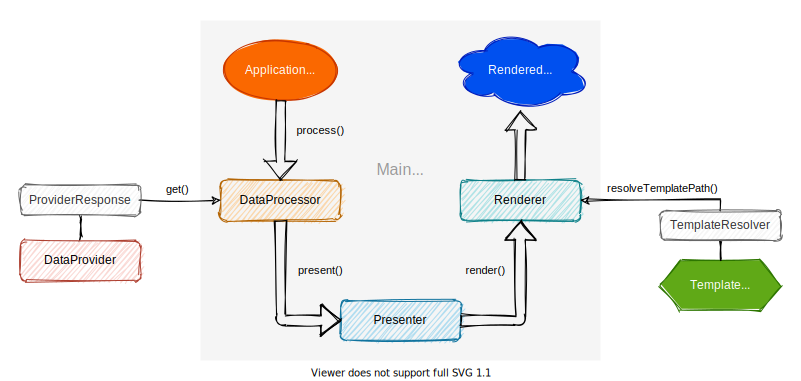

.. include:: ../Includes.txt

.. _rendering-concept:

=================
Rendering concept
=================

The following components are involved in the rendering process and
assume different roles in the MVC pattern:

.. contents::
   :local:
   :depth: 1

.. _data-provider:

`DataProvider` (*Model*)
========================

.. rst-class:: horizbuttons-primary-m

-  `DataProviderInterface <https://github.com/CPS-IT/handlebars/blob/main/Classes/Data/DataProviderInterface.php>`__

`DataProviders` are used to provide relevant data for processing by a
`DataProcessor`. The data source is irrelevant: data can be provided both
from local sources such as the TYPO3 database and from external sources
such as APIs.

Thus, `DataProviders` fulfill the part of the *Model* in the MVC pattern.
The data supplied is not necessarily only applicable to a specific template,
but serves the general usability of all components involved in the rendering
process of a parent module.

.. _data-processor:

`DataProcessor` (*Controller*)
==============================

.. rst-class:: horizbuttons-primary-m

-  `DataProcessorInterface <https://github.com/CPS-IT/handlebars/blob/main/Classes/DataProcessing/DataProcessorInterface.php>`__
-  `AbstractDataProcessor <https://github.com/CPS-IT/handlebars/blob/main/Classes/DataProcessing/AbstractDataProcessor.php>`__

`DataProcessors` are the entry point into the entire rendering process.
They fetch the data from the `DataProvider`, process it and pass it on to
the `Presenter`.

This is where the entire processing logic takes place. Thus, `DataProcessors`
fulfill the part of the *Controller* in the MVC pattern. They are usually
addressed directly via TypoScript.

.. _presenter:

`Presenter` (*View transition*)
===============================

.. rst-class:: horizbuttons-primary-m

-  `PresenterInterface <https://github.com/CPS-IT/handlebars/blob/main/Classes/Presenter/PresenterInterface.php>`__
-  `AbstractPresenter <https://github.com/CPS-IT/handlebars/blob/main/Classes/Presenter/AbstractPresenter.php>`__

In `Presenter`, the supplied data is prepared for rendering a specific
Handlebars template. Dependent templates can also be selected based on
the supplied data if multiple template variants are possible.

In the MVC pattern, the `Presenter` takes on a transitional role
between the `DataProcessor` (*Controller*) and the `Renderer` (*View*).

.. _renderer:

`Renderer` (*View*)
===================

.. rst-class:: horizbuttons-primary-m

-  `RendererInterface <https://github.com/CPS-IT/handlebars/blob/main/Classes/Renderer/RendererInterface.php>`__
-  `HandlebarsRenderer <https://github.com/CPS-IT/handlebars/blob/main/Classes/Renderer/HandlebarsRenderer.php>`__

The template is finally rendered in the `Renderer`. For this purpose,
the template is compiled and filled with data from the `Presenter`. The
resulting output is returned and completes the rendering process.

The `Renderer` is thus responsible for the *View* in the context of the
MVC pattern. The compiled templates used for this are usually cached.

.. _helper:

`Helper` (optional)
===================

.. rst-class:: horizbuttons-primary-m

-  `HelperInterface <https://github.com/CPS-IT/handlebars/blob/main/Classes/Renderer/Helper/HelperInterface.php>`__

`Helpers` describe a simple way to bring custom PHP functionality to
Handlebars templates. They are similar to ViewHelpers used in Fluid
templates.

The default `Renderer` is able to handle various `Helpers`. There are
few limitations to the successful use of `Helpers`:

* The associated callable (class method/function) must be publicly
  callable
* If the callable is a class method, it must be loadable by the
  registered PHP class autoloader

`Helpers` play a rather subordinate role in the MVC pattern, since
they are not explicitly involved. However, since they are implicitly
involved in the output of a template, they most likely take the role
of the *View*.

.. _template-resolver:

`TemplateResolver`
==================

.. rst-class:: horizbuttons-primary-m

-  `TemplateResolverInterface <https://github.com/CPS-IT/handlebars/blob/main/Classes/Renderer/Template/TemplateResolverInterface.php>`__
-  `HandlebarsTemplateResolver <https://github.com/CPS-IT/handlebars/blob/main/Classes/Renderer/Template/HandlebarsTemplateResolver.php>`__

Whenever a template is rendered by the `Renderer`, it must first be
resolved, e.g. by looking it up in all defined template root paths. It
is necessary to define a `TemplateResolver` for each `Renderer`, because
the `Renderer` itself is not able to resolve template paths.

The `TemplateResolver` is also used for resolving partials. However,
since partials do not necessarily have to be used, defining a
`TemplateResolver` for them is optional.
