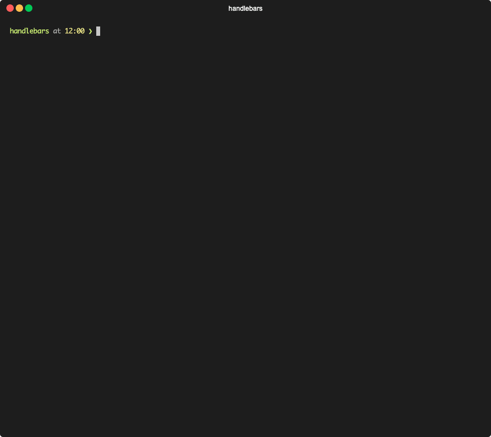

.. include:: ../../Includes.txt

.. _create-new-helper:

===================
Create a new helper
===================

.. versionadded:: 0.8.0

   `Feature: #22 - Introduce various console commands <https://github.com/CPS-IT/handlebars/pull/22>`__

With this command it is possible to create a new Handlebars helper
from the command-line. Since helpers must be unique in the system,
the command fails if a helper should be created that already exists.

.. important::

   You need to **recreate the service container** after successful creation.
   Alternatively, you can also use the `--flush-cache` option for this.

.. _create-new-helper-usage:

Usage
=====

.. code-block:: bash

   handlebars:new:helper <name> -e|--extension-key EXTENSION-KEY \
      [-c|--class-name CLASS-NAME] \
      [-m|--method-name METHOD-NAME] \
      [--force-overwrite] \
      [--flush-cache]

.. _create-new-helper-affected-files:

Affected files
==============

+----------------------------+--------------------------------------------------+-----------+
| File                       | Path                                             | State     |
+============================+==================================================+===========+
| `Helper` class             | :file:`Classes/Renderer/Helper/<class-name>.php` | Generated |
+----------------------------+--------------------------------------------------+-----------+
| :file:`Services.yaml` file | :file:`Configuration/Services.yaml`              | Updated   |
+----------------------------+--------------------------------------------------+-----------+

.. _create-new-helper-arguments:

Arguments
=========

.. _create-new-helper-arguments-name:
.. container:: table-row

   Property
      name

   Data type
      string

   Description
      Unique name of the new Handlebars helper to be created.

      **Note:** The name must not be already registered for a
      Handlebars helper, otherwise the command fails.

.. _create-new-helper-options:

Options
=======

.. _create-new-helper-options-extension-key:
.. container:: table-row

   Property
      `--extension-key`, `-e`

   Data type
      string

   Description
      Extension key of the extension where to create the new
      Handlebars helper.

      **Note:** This must be the extension key of an activated
      third-party extension.

.. _create-new-helper-options-class-name:
.. container:: table-row

   Property
      `--class-name`, `-c`

   Data type
      string

   Description
      Optional class name to be used for the resulting PHP class.
      If it is omitted, the class name is automatically generated.

   Default
      :php:`<Name>Helper`

.. _create-new-helper-options-method-name:
.. container:: table-row

   Property
      `--method-name`, `-m`

   Data type
      string

   Description
      Optional method name to be used for the resulting PHP class.

   Default
      :php:`evaluate`

.. _create-new-helper-options-force-overwrite:
.. container:: table-row

   Property
      `--force-overwrite`

   Data type
      boolean

   Description
      Enforce overwriting of files that need to be changed, but
      already exist.

      **Attention:** Especially for :file:`Services.yaml` file, this
      can give an undesirable result.

   Default
      :php:`false`

.. _create-new-helper-options-flush-cache:
.. container:: table-row

   Property
      `--flush-cache`

   Data type
      boolean

   Description
      Flush DI cache after successful file generation.

      **Note:** DI cache is only flushed if the :file:`Services.yaml`
      file was written, e.g. if it did not exist before or was
      enforced to be rewritten by `--force-overwrite`.

   Default
      :php:`false`

.. _create-new-helper-examples:

Examples
========

.. code-block:: bash

   # No parameters (interactive mode)
   typo3 handlebars:new:helper

   # Default (with name and extension key as parameters)
   typo3 handlebars:new:helper "baz" -e "foo"

   # Complete example
   typo3 handlebars:new:helper "baz" -e "foo" -c "FooHelper" -m "evaluate"

   # Force overwrite of existing files
   typo3 handlebars:new:helper "baz" -e "foo" --force-overwrite

   # Flush DI cache afterwards
   typo3 handlebars:new:helper "baz" -e "foo" --flush-cache
