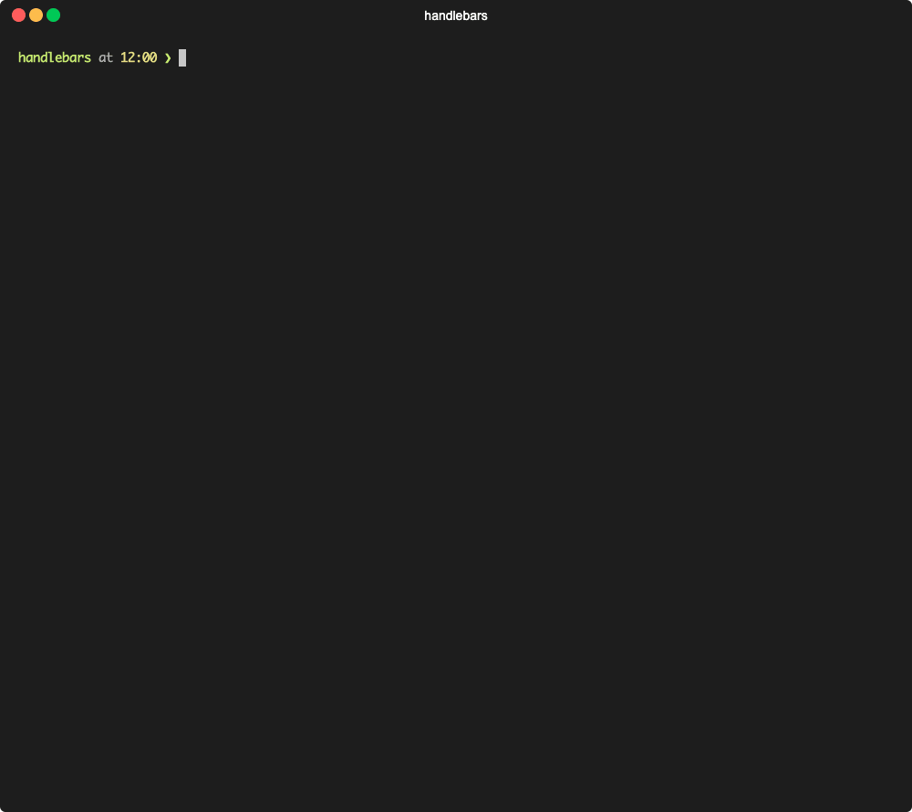

.. include:: ../../Includes.txt

.. _create-new-module:

===================
Create a new module
===================

.. versionadded:: 0.8.0

   `Feature: #22 - Introduce various console commands <https://github.com/CPS-IT/handlebars/pull/22>`__

This command can be used to create an entire Handlebars module including all
necessary components (`DataProcessor`, `DataProvider`, `ProviderResponse` and
`Presenter`). The module must not already exist in the selected extension,
but can also be explicitly overwritten.

.. important::

   You need to **recreate the service container** after successful creation.
   Alternatively, you can also use the `--flush-cache` option for this.

.. _create-new-module-usage:

Usage
=====

.. code-block:: bash

   handlebars:new:module <name> -e|--extension-key EXTENSION-KEY \
      [--force-overwrite] \
      [--flush-cache]

.. _create-new-module-affected-files:

Affected files
==============

+----------------------------+----------------------------------------------------------+-----------+
| File                       | Path                                                     | State     |
+============================+==========================================================+===========+
| `DataProcessor` class      | :file:`Classes/DataProcessing/<name>Processor.php`       | Generated |
+----------------------------+----------------------------------------------------------+-----------+
| `DataProvider` class       | :file:`Classes/Data/<name>Provider.php`                  | Generated |
+----------------------------+----------------------------------------------------------+-----------+
| `ProviderResponse` class   | :file:`Classes/Data/Response/<name>ProviderResponse.php` | Generated |
+----------------------------+----------------------------------------------------------+-----------+
| `Presenter` class          | :file:`Classes/Presenter/<name>Presenter.php`            | Generated |
+----------------------------+----------------------------------------------------------+-----------+
| :file:`Services.yaml` file | :file:`Configuration/Services.yaml`                      | Updated   |
+----------------------------+----------------------------------------------------------+-----------+

.. _create-new-module-arguments:

Arguments
=========

.. _create-new-module-arguments-name:
.. container:: table-row

   Property
      name

   Data type
      string

   Description
      Name of the new Handlebars module to be created.

      **Note:** The name must not be already registered for a
      Handlebars module in the selected extension, otherwise
      the command fails.

.. _create-new-module-options:

Options
=======

.. _create-new-module-options-extension-key:
.. container:: table-row

   Property
      `--extension-key`, `-e`

   Data type
      string

   Description
      Extension key of the extension where to create the new
      Handlebars module.

      **Note:** This must be the extension key of an activated
      third-party extension.

.. _create-new-module-options-force-overwrite:
.. container:: table-row

   Property
      `--force-overwrite`

   Data type
      boolean

   Description
      Enforce overwriting of files that need to be changed, but
      already exist.

      **Attention:** Especially for :file:`Services.yaml` file, this
      can give an undesirable result.

   Default
      :php:`false`

.. _create-new-module-options-flush-cache:
.. container:: table-row

   Property
      `--flush-cache`

   Data type
      boolean

   Description
      Flush DI cache after successful file generation.

      **Note:** DI cache is only flushed if the :file:`Services.yaml`
      file was written, e.g. if it did not exist before or was
      enforced to be rewritten by `--force-overwrite`.

   Default
      :php:`false`

.. _create-new-module-examples:

Examples
========

.. code-block:: bash

   # No parameters (interactive mode)
   typo3 handlebars:new:module

   # Default (with name and extension key as parameters)
   typo3 handlebars:new:module "baz" -e "foo"

   # Force overwrite of existing files
   typo3 handlebars:new:module "baz" -e "foo" --force-overwrite

   # Flush DI cache afterwards
   typo3 handlebars:new:module "baz" -e "foo" --flush-cache
