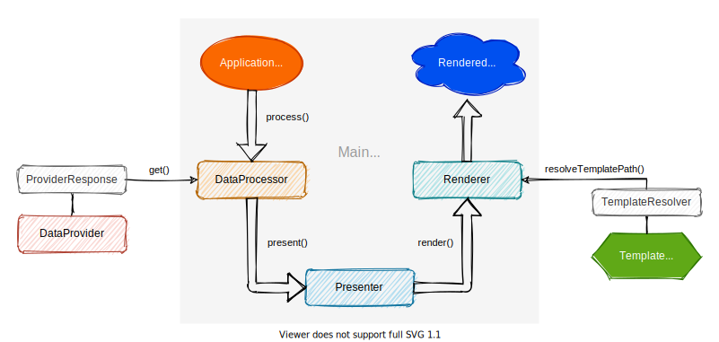

# Rendering process


<a href="../assets/img/rendering-chart.svg" data-toggle="lightbox">
    {: style="width: 100%" }
</a>

## Trigger

The rendering process is normally **triggered through TypoScript** (using the
`ContentObjectRenderer`) by calling the `DataProcessor`:

```typo3_typoscript linenums="1"
# Configuration/TypoScript/setup.typoscript

tt_content.textmedia = USER
tt_content.textmedia.userFunc = Fr\Sitepackage\DataProcessing\TextMediaProcessor
```

## Fetch data

In the next step the `DataProcessor` **gets the relevant data** from the `DataProvider`:

```php
$data = $this->provider->get($this->cObj->data);
```

Each `DataProvider` returns an object which implements the
[`ProviderResponseInterface`]({{ repository.blob }}/Classes/Data/Response/ProviderResponseInterface.php):

```php linenums="1"
# Classes/Data/Response/TextMediaProviderResponse.php

namespace Fr\Sitepackage\Data\Response;

use Fr\Typo3Handlebars\Data\Response\ProviderResponseInterface;

class TextMediaProviderResponse implements ProviderResponseInterface
{
    /**
     * @var string
     */
    protected $layout = '';

    public function getLayout(): string
    {
        return $this->layout;
    }

    public function setLayout(string $layout): self
    {
        $this->layout = $layout;
        return $this;
    }

    // ...

    pubflic function toArray(): array
    {
        return [
            'layout' => $this->layout,
            // ...
        ];
    }
}
```

## Process data

The provided data is now transferred to the `Presenter`, which **prepares the data** for
rendering and then **triggers the actual rendering**:

```php
$renderedTemplate = $this->presenter->present($data);
return $renderedTemplate;
```

It is up to the `Presenter` to trigger the rendering differently based on the given data:

```php linenums="1"
# Classes/Presenter/TextMediaPresenter.php

namespace Fr\Sitepackage\Presenter;

use Fr\Sitepackage\Data\Response\TextMediaProviderResponse;
use Fr\Typo3Handlebars\Data\Response\ProviderResponseInterface;
use Fr\Typo3Handlebars\Presenter\PresenterInterface;

class TextMediaPresenter implements PresenterInterface
{
    public function present(ProviderResponseInterface $data): string
    {
        if (!($data instanceof TextMediaProviderResponse)) {
            throw new UnableToPresentException(
                'Received unexpected response from DataProvider.',
                1613552420
            );
        }
        if ($data->getLayout() === 'wide') {
            return $this->presentWide($data);
        }
        return $this->presentNormal($data);
    }

    protected function presentWide(TextMediaProviderResponse $data): string
    {
        return $this->renderer->render(
            'Extensions/FluidStyledContent/TextMedia/Wide',
            $data->toArray()
        );
    }

    protected function presentNormal(TextMediaProviderResponse $data): string
    {
        return $this->renderer->render(
            'Extensions/FluidStyledContent/TextMedia/Normal',
            $data->toArray()
        );
    }
}
```

## Render template

In the `Renderer` the **template path is now resolved** and the rendering is triggered. If the
template is already in the cache, it will be treated preferentially. In any case, the **compiled
template is cached** to speed up subsequent renderings.

Finally, the rendered template is returned to the `ContentObjectRenderer` which triggered the
`DataProcessor` from TypoScript.
